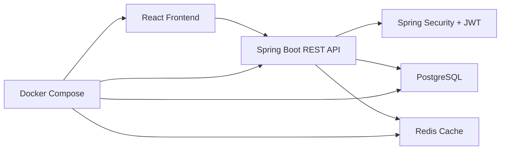

# cloud-inventory-order-management

Cloud-Based Inventory & Order Management System built with Java, Spring Boot, React, PostgreSQL, Redis, and Docker. This project simulates how an enterprise operations team manages products, suppliers, stock movements, purchase orders, customer orders, and warehouse workflows through a role-based internal platform.

## Quick Highlights

- Enterprise-style full-stack inventory platform built with Java, Spring Boot, React, PostgreSQL, Redis, and Docker
- JWT authentication plus role-based access control for `ADMIN`, `MANAGER`, and `WAREHOUSE_USER`
- 15+ REST API flows across products, suppliers, inventory, orders, user access, and dashboard reporting
- Seeded synthetic business data so reviewers can sign in immediately and test realistic workflows
- Recruiter-friendly documentation with architecture, schema design, API coverage, setup, and demo credentials

## Resume Summary

**Cloud-Based Inventory & Order Management System | Java, Spring Boot, React, PostgreSQL, Redis, Docker**

- Built a full-stack inventory system in Java/Spring Boot with 15+ REST APIs, JWT authentication, supplier management, and role-based access control.
- Designed PostgreSQL schemas for products, suppliers, orders, users, and inventory transactions using synthetic enterprise business data.
- Integrated Redis caching and Docker-based deployment to improve product lookup performance and simplify local environment setup.
- Structured the application into business modules for auth, products, suppliers, inventory, orders, and dashboard reporting to reflect enterprise architecture patterns.

## Project Overview

Recruiters often see CRUD demos that stop at "users and products." This project goes further by modeling the day-to-day operational flow of a company:

- authenticated users sign in with JWT-based access control
- admins and managers manage products, suppliers, and users
- warehouse users process stock updates and inventory movements
- operations teams create customer orders and purchase orders
- low-stock alerts and dashboard summaries help support replenishment decisions
- Redis caching reduces repeated reads for product and inventory-heavy views

## Problem Statement

Companies that sell and store physical goods need more than a simple product list. They need a system that can:

- track warehouse stock accurately
- connect products to suppliers
- create customer orders and supplier purchase orders
- monitor low-stock risk before it turns into a fulfillment issue
- enforce role-based access so each team member only sees what they should manage

This project was designed to simulate that operational environment using synthetic business data.

## Features

- JWT authentication with login and registration
- role-based access control for `ADMIN`, `MANAGER`, and `WAREHOUSE_USER`
- product management with stock, reorder level, and warehouse location
- supplier management with contact and lead-time details
- inventory stock updates and transaction history
- customer order creation with automatic stock deduction
- purchase order creation for replenishment workflows
- low-stock alert monitoring
- dashboard summary for products, suppliers, stock units, orders, and users
- Redis caching for product catalog and low-stock retrieval
- Dockerized full-stack setup with PostgreSQL and Redis
- seeded synthetic data for products, suppliers, orders, and demo users

## Tech Stack

### Backend

- Java 17
- Spring Boot
- Spring Security
- JWT
- Spring Data JPA
- PostgreSQL
- Redis
- Maven

### Frontend

- React
- TypeScript
- Axios
- React Router
- Tailwind CSS
- Vite

### DevOps

- Docker
- Docker Compose

## System Architecture



More detail: [architecture.md](docs/architecture.md)

## Repository Structure

```text
cloud-inventory-order-management/
├── README.md
├── frontend/
├── backend/
├── database/
├── docker-compose.yml
├── .env.example
├── screenshots/
└── docs/
```

## Frontend Pages

- Login
- Dashboard
- Products
- Suppliers
- Inventory
- Orders
- Low Stock Alerts
- User Management

## Backend Modules

- `auth`
- `users`
- `products`
- `suppliers`
- `inventory`
- `orders`
- `dashboard`

## Demo Credentials

Use these seeded demo accounts after startup:

- Admin: `admin / Admin@123`
- Manager: `manager / Manager@123`
- Warehouse User: `warehouse / Warehouse@123`

## Synthetic Business Data

This application uses synthetic enterprise-style sample data so the data origin is clear and interview-safe.

### Sample products

- laptops
- monitors
- keyboards
- medical supplies
- sensors
- barcode scanners

### Sample suppliers

- TechSupply Inc.
- Global Parts Co.
- Warehouse Direct

### Sample business records

- sample customer sales order
- sample purchase order
- seeded low-stock items for alert testing

## Database Design

### Core tables

- `users`
- `roles`
- `user_roles`
- `products`
- `suppliers`
- `inventory_transactions`
- `orders`
- `order_items`
- `purchase_orders`

Schema explanation: [database-schema.md](docs/database-schema.md)

## API Endpoints

### Authentication

- `POST /api/auth/register`
- `POST /api/auth/login`

### Products

- `GET /api/products`
- `POST /api/products`
- `PUT /api/products/{id}`
- `DELETE /api/products/{id}`

### Suppliers

- `GET /api/suppliers`
- `POST /api/suppliers`

### Inventory

- `POST /api/inventory/update`
- `GET /api/inventory/low-stock`
- `GET /api/inventory/transactions`

### Orders

- `POST /api/orders`
- `GET /api/orders`
- `PUT /api/orders/{id}/status`
- `POST /api/orders/purchase`
- `GET /api/orders/purchase`

### Dashboard

- `GET /api/dashboard/summary`

Full endpoint list: [api-endpoints.md](docs/api-endpoints.md)

## How To Run Locally

### Option 1: Docker Compose

1. Copy `.env.example` to `.env`.
2. Run `docker compose up --build`.
3. Open the frontend at [http://localhost:3000](http://localhost:3000).
4. The backend API will be available at [http://localhost:8080](http://localhost:8080).

### Option 2: Run services manually

1. Start PostgreSQL and Redis locally.
2. Update environment variables using `.env.example`.
3. Start backend from `/backend` with Maven:
   `mvn spring-boot:run`
4. Start frontend from `/frontend`:
   `npm install`
   `npm run dev`

## Screenshots

Place screenshots in [screenshots/README.md](screenshots/README.md) using names like:

- `login-page.png`
- `dashboard.png`
- `products-page.png`
- `inventory-page.png`
- `orders-page.png`
- `low-stock-alerts.png`

Recommended order on the GitHub page:

1. Login page
2. Dashboard summary
3. Products and suppliers
4. Inventory updates and transaction history
5. Orders and low-stock alerts

## Challenges And Solutions

### 1. Modeling realistic inventory workflows

Challenge:
Simple CRUD alone does not show how stock actually changes in business systems.

Solution:
I introduced `inventory_transactions`, customer order allocation, purchase orders, reorder levels, and warehouse locations so the project reflects real operations instead of just static records.

### 2. Preventing overexposed endpoints

Challenge:
Warehouse staff, managers, and admins should not all have the same permissions.

Solution:
Spring Security with JWT and role-based access control protects endpoints and enables route-aware frontend navigation.

### 3. Performance on repeated reads

Challenge:
Products and low-stock dashboards are read frequently and can create unnecessary repeated database access.

Solution:
Redis caching is used for product and low-stock queries so common inventory views can be served faster.

### 4. Making the project easy to review

Challenge:
Recruiters may never run the code.

Solution:
The repository is structured with clear folders, setup steps, schema documentation, endpoint documentation, architecture diagrams, and seeded demo credentials.

## Future Improvements

- add pagination, filtering, and search for larger product catalogs
- introduce warehouse-to-warehouse transfer workflows
- add audit logs for authentication and admin actions
- support file uploads for purchase order attachments and invoices
- expand analytics with demand forecasting and supplier performance KPIs
- add automated tests for controllers, services, and frontend flows
- deploy the stack to a cloud platform with CI/CD

## Notes

- The application has been verified locally with Docker Compose, seeded demo accounts, JWT authentication, and protected API access.
- Adding real screenshots is the highest-impact next improvement for GitHub presentation quality.
