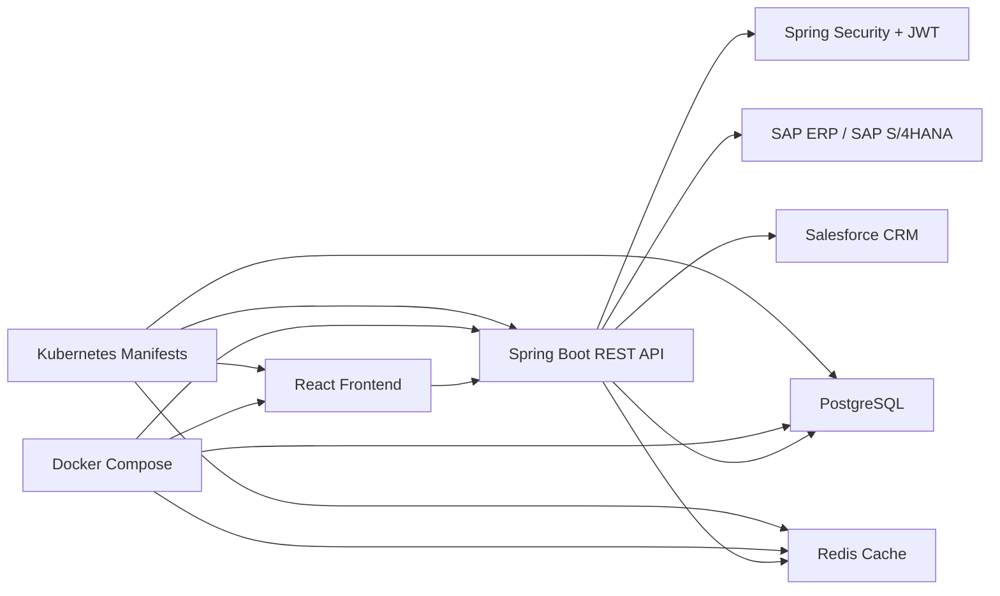

# Enterprise Inventory & Customer Order Management Platform

Enterprise Inventory & Customer Order Management Platform built with Java, Spring Boot, React, PostgreSQL, Redis, Docker, Kubernetes manifests, and enterprise integration assets for SAP ERP, SAP S/4HANA, and Salesforce CRM. This project simulates an internal operational platform that acts as a central integration hub between warehouse workflows, ERP inventory systems, and CRM-driven customer order visibility.

## Quick Highlights

- Enterprise-style full-stack inventory platform built with Java, Spring Boot, React, PostgreSQL, Redis, Docker, and Kubernetes-ready manifests
- JWT authentication plus role-based access control for `ADMIN`, `MANAGER`, and `WAREHOUSE_USER`
- 15+ REST API flows across products, suppliers, inventory, orders, customers, integrations, user access, and dashboard reporting
- SAP ERP and SAP S/4HANA sync flows for inventory and purchase-order visibility
- Salesforce CRM integration assets including outbound order sync, customer mapping, Apex trigger examples, and SOQL query samples
- Seeded synthetic business data so reviewers can sign in immediately and test realistic workflows

## Resume Summary

**Enterprise Inventory & Customer Order Management Platform | Java, Spring Boot, React, PostgreSQL, Redis, Docker, SAP ERP, SAP S/4HANA, Salesforce CRM, Apex, SOQL**

- Built an enterprise-grade inventory and order management platform in Java/Spring Boot with 15+ REST APIs, JWT authentication, supplier management, and role-based access control serving as a central integration hub between SAP and Salesforce.
- Added SAP ERP and SAP S/4HANA OData-style integration flows to synchronize inventory levels and purchase order records into the platform.
- Connected Salesforce CRM workflows through REST-style sync endpoints, customer account mappings, Apex trigger assets, and SOQL query examples for customer and order history retrieval.
- Designed PostgreSQL schemas with Redis caching plus Docker and Kubernetes deployment assets, and reduced N+1-style read inefficiencies through fetch optimization and database-side aggregation.

## Project Overview

Recruiters often see CRUD demos that stop at "users and products." This project goes further by modeling the day-to-day operational flow of a company:

- authenticated users sign in with JWT-based access control
- admins and managers manage products, suppliers, and users
- warehouse users process stock updates and inventory movements
- operations teams create customer orders and purchase orders
- low-stock alerts and dashboard summaries help support replenishment decisions
- Redis caching reduces repeated reads for product and inventory-heavy views
- Kubernetes manifests extend the deployment story beyond local Docker Compose into cluster-based environments
- SAP ERP and SAP S/4HANA synchronization flows update internal inventory and purchase-order views
- Salesforce CRM integration assets model outbound order sync plus inbound customer history retrieval

## Problem Statement

Companies that sell and store physical goods need more than a simple product list. They need a system that can:

- track warehouse stock accurately
- connect products to suppliers
- create customer orders and supplier purchase orders
- monitor low-stock risk before it turns into a fulfillment issue
- enforce role-based access so each team member only sees what they should manage
- coordinate operational data with upstream ERP systems and downstream CRM workflows

This project was designed to simulate that operational environment using synthetic business data and enterprise integration patterns.

## Features

- JWT authentication with login and registration
- role-based access control for `ADMIN`, `MANAGER`, and `WAREHOUSE_USER`
- product management with stock, reorder level, and warehouse location
- supplier management with contact and lead-time details
- inventory stock updates and transaction history
- customer order creation with automatic stock deduction
- purchase order creation for replenishment workflows
- low-stock alert monitoring
- dashboard summary for products, suppliers, stock units, orders, users, and integration activity
- Redis caching for product catalog and low-stock retrieval
- Dockerized full-stack setup with PostgreSQL and Redis
- Kubernetes manifests for backend, frontend, PostgreSQL, and Redis deployment
- SAP ERP and SAP S/4HANA integration endpoints for inventory and purchase-order synchronization
- Salesforce CRM integration endpoints for order push and customer history retrieval
- Apex trigger and SOQL example assets to represent CRM automation patterns
- seeded synthetic data for products, suppliers, orders, customer accounts, sync events, and demo users

## Tech Stack

### Backend

- Java 17
- Spring Boot
- Spring Security
- JWT
- Spring Data JPA
- PostgreSQL
- Redis
- Maven
- SAP ERP OData integration patterns
- SAP S/4HANA OData integration patterns
- Salesforce CRM REST integration patterns

### Frontend

- React
- TypeScript
- Axios
- React Router
- Tailwind CSS
- Vite

### DevOps

- Docker
- Docker Compose
- Kubernetes

### Enterprise Integration Assets

- Salesforce Apex trigger examples
- SOQL query examples
- SAP and Salesforce integration configuration patterns

## System Architecture



More detail: [architecture.md](docs/architecture.md)

## Repository Structure

```text
enterprise-inventory-customer-order-platform/
|-- README.md
|-- frontend/
|-- backend/
|-- database/
|-- k8s/
|-- salesforce/
|-- docker-compose.yml
|-- .env.example
|-- screenshots/
`-- docs/
```

## Frontend Pages

- Login
- Dashboard
- Products
- Suppliers
- Inventory
- Orders
- Low Stock Alerts
- Integration Hub
- User Management

## Backend Modules

- `auth`
- `users`
- `customers`
- `products`
- `suppliers`
- `inventory`
- `orders`
- `dashboard`
- `integration.sap`
- `integration.salesforce`
- `integration.common`

## Demo Credentials

Use these seeded demo accounts after startup:

- Admin: `admin / Admin@123`
- Manager: `manager / Manager@123`
- Warehouse User: `warehouse / Warehouse@123`

## Synthetic Business Data

This application uses synthetic enterprise-style sample data so the data origin is clear and interview-safe.

### Sample products

- laptops
- monitors
- keyboards
- medical supplies
- sensors
- barcode scanners

### Sample suppliers

- TechSupply Inc.
- Global Parts Co.
- Warehouse Direct

### Sample business records

- sample customer sales order
- sample purchase order
- seeded low-stock items for alert testing
- sample customer CRM account mappings
- sample SAP and Salesforce sync event history

## Database Design

### Core tables

- `users`
- `roles`
- `user_roles`
- `products`
- `suppliers`
- `inventory_transactions`
- `orders`
- `order_items`
- `purchase_orders`
- `customer_accounts`
- `integration_sync_events`

Schema explanation: [database-schema.md](docs/database-schema.md)

This repository includes 10+ operational tables and relationships across users, roles, product catalogs, supplier records, inventory transactions, sales orders, order items, purchase orders, CRM customer mappings, and sync audit events.

## API Endpoints

### Authentication

- `POST /api/auth/register`
- `POST /api/auth/login`

### Products

- `GET /api/products`
- `POST /api/products`
- `PUT /api/products/{id}`
- `DELETE /api/products/{id}`

### Suppliers

- `GET /api/suppliers`
- `POST /api/suppliers`

### Inventory

- `POST /api/inventory/update`
- `GET /api/inventory/low-stock`
- `GET /api/inventory/transactions`

### Orders

- `POST /api/orders`
- `GET /api/orders`
- `PUT /api/orders/{id}/status`
- `POST /api/orders/purchase`
- `GET /api/orders/purchase`

### Customers

- `GET /api/customers`

### Dashboard

- `GET /api/dashboard/summary`

### Enterprise Integrations

- `GET /api/integrations/overview`
- `GET /api/integrations/sap/health`
- `POST /api/integrations/sap/inventory-sync`
- `POST /api/integrations/sap/purchase-orders/sync`
- `GET /api/integrations/salesforce/health`
- `POST /api/integrations/salesforce/orders/{orderId}/push`
- `GET /api/integrations/salesforce/history/{customerEmail}`

Full endpoint list: [api-endpoints.md](docs/api-endpoints.md)
Integration notes: [sap-salesforce-integration.md](docs/sap-salesforce-integration.md)

## How To Run Locally

### Option 1: Docker Compose

1. Copy `.env.example` to `.env`.
2. Run `docker compose up --build`.
3. Open the frontend at [http://localhost:3000](http://localhost:3000).
4. The backend API will be available at [http://localhost:8080](http://localhost:8080).

### Option 1B: Kubernetes

1. Build and publish backend and frontend images to your registry.
2. Copy `k8s/base/secret.example.yaml` to `k8s/base/secret.yaml` and replace placeholder values.
3. Apply the Kubernetes manifests:
   `kubectl apply -f k8s/base/secret.yaml`
   `kubectl apply -k k8s/base`
4. Review the deployment guide in [kubernetes-deployment.md](docs/kubernetes-deployment.md).

### Option 2: Run Services Manually

1. Start PostgreSQL and Redis locally.
2. Update environment variables using `.env.example`.
3. Start backend from `/backend` with Maven:
   `mvn spring-boot:run`
4. Start frontend from `/frontend`:
   `npm install`
   `npm run dev`

## Screenshots

Place screenshots in [screenshots/README.md](screenshots/README.md) using names like:

- `login-page.png`
- `dashboard.png`
- `products-page.png`
- `inventory-page.png`
- `orders-page.png`
- `integrations-page.png`
- `low-stock-alerts.png`

Recommended order on the GitHub page:

1. Login page
2. Dashboard summary
3. Products and suppliers
4. Inventory updates and transaction history
5. Orders and low-stock alerts
6. SAP and Salesforce integration hub

## Challenges And Solutions

### 1. Modeling realistic inventory workflows

Challenge:
Simple CRUD alone does not show how stock actually changes in business systems.

Solution:
I introduced `inventory_transactions`, customer order allocation, purchase orders, reorder levels, and warehouse locations so the project reflects real operations instead of just static records.

### 2. Preventing overexposed endpoints

Challenge:
Warehouse staff, managers, and admins should not all have the same permissions.

Solution:
Spring Security with JWT and role-based access control protects endpoints and enables route-aware frontend navigation.

### 3. Performance on repeated reads

Challenge:
Products, low-stock dashboards, and integration-heavy views are read frequently and can create unnecessary repeated database access.

Solution:
Redis caching is used for product and low-stock queries, while optimized entity loading, repository-level fetch strategies, and database-side aggregation reduce unnecessary repeated reads in inventory-heavy and sync-heavy flows.

### 4. Integrating external enterprise systems

Challenge:
Operational platforms often need to reconcile data between ERP systems and CRM systems without losing the internal workflow context.

Solution:
I added SAP-facing inventory and purchase-order sync services, Salesforce-facing order push and customer history flows, customer mapping records, sync audit events, and example Apex/SOQL assets to model a realistic integration hub architecture.

### 5. Making the project easy to review

Challenge:
Recruiters may never run the code.

Solution:
The repository is structured with clear folders, setup steps, schema documentation, endpoint documentation, architecture diagrams, seeded demo credentials, and enterprise integration notes.

## Future Improvements

- add pagination, filtering, and search for larger product catalogs
- introduce warehouse-to-warehouse transfer workflows
- add audit logs for authentication and admin actions
- connect to real SAP and Salesforce sandboxes instead of mock-mode integration flows
- expand analytics with demand forecasting and supplier performance KPIs
- add automated tests for controllers, services, and frontend flows
- deploy the stack to a cloud platform with CI/CD
- add Helm charts and environment-specific Kubernetes overlays

## Notes

- The application has been verified locally with Docker Compose, seeded demo accounts, JWT authentication, and protected API access.
- Kubernetes manifests are included for cluster-oriented deployment workflows, but image names and secrets should be adjusted for your target environment before production use.
- The SAP and Salesforce pieces are mock-mode integration assets by default so the platform remains runnable without enterprise credentials.
- Adding real screenshots is the highest-impact next improvement for GitHub presentation quality.
