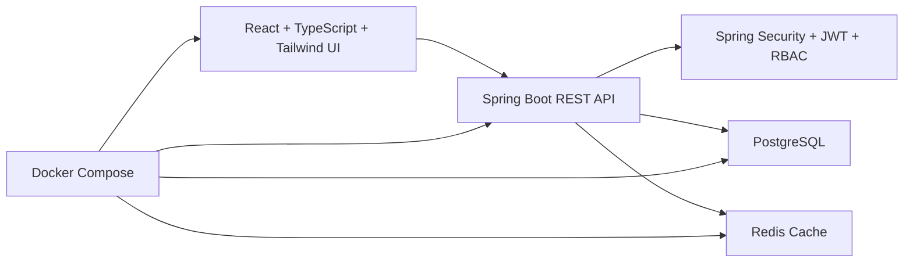

# System Architecture

## Key design notes

- The frontend is a role-aware SPA with route protection and authenticated API requests.
- The backend is organized by business modules: `auth`, `users`, `products`, `suppliers`, `inventory`, `orders`, and `dashboard`.
- PostgreSQL stores operational business records such as products, suppliers, users, stock movements, and orders.
- Redis caches product and low-stock queries to reduce repeated database reads.
- Docker Compose provides a one-command local environment for frontend, backend, PostgreSQL, and Redis.
